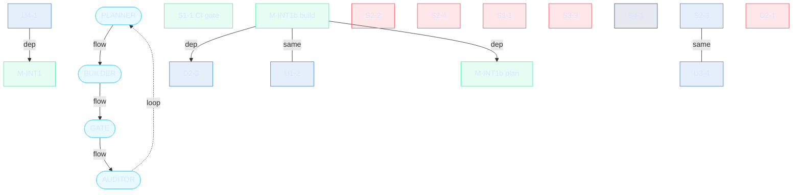

# Proxima Trail — Remediation Graph

> Generated 2026-06-28 by `AgenticOS/graphify.js` from `AgenticOS/graph-state.json`. Do not hand-edit — edit the state file (or the roadmap) and re-run `node AgenticOS/graphify.js`.

- **Branch:** `claude/intelligent-galileo-y2siqb`
- **Audit:** M-INT1b PASS @ ad92ece (CI run 28338588653, success)
- **Progress:** 4 / 14 items done (excluding deferred)

## pipeline

| id | label | state | owner | sha | note |
|----|-------|-------|-------|-----|------|
| `planner` | PLANNER | active | CC subagent | — | Read-only. Reads HEAD -> exact edit spec citing committed lines. Returns FENCED for fenced items. |
| `builder` | BUILDER | active | CC subagent | — | Implements ONLY the spec. Commit-first, then self-checks vs committed bytes. Runs scripts/verify.sh by exit code, not stdout. |
| `gate` | GATE | active | scripts/verify.sh | `3fb4a37` | Deterministic. set -euo pipefail, MIN_TESTS=8 guard, frozen-three md5 + composeEnding golden (endings_golden). Refuses a vacuous pass. |
| `auditor` | AUDITOR | active | CC subagent | — | Read-only, NO Write/Edit. Receives only {spec, SHA, gate results}; reads committed bytes itself. May block even if the gate is green. |

## milestone

| id | label | state | owner | sha | note |
|----|-------|-------|-------|-----|------|
| `M-INT1` | M-INT1 | done | shipped | — | Endings re-tier. composeEnding golden-locked (NOT md5-frozen) — verified by endings_golden (13 endings pinned). |
| `M-INT1b-plan` | M-INT1b plan | done | Planner / CC | `2123d1e` | Locked plan section committed (pure append). [2a]/[3a]/[1c] spec. |
| `M-INT1b-code` | M-INT1b build | done | Builder | `ad92ece` | Presentation-only legibility wrapper: [2a] both-fronts strip, [3a] single canonical clock (repoint col.elapsedYears -> exodusYears() at game.js:4553), [1c] read-only off-front digest. Built ad92ece; gate green (CI 28338588653); Auditor PASS — frozen-three md5-identical, composeEnding golden, no scope creep / sacred-list change. |

## Track A · code

| id | label | state | owner | sha | note |
|----|-------|-------|-------|-----|------|
| `S1-1` | S1-1 CI gate | done | Builder | `3fb4a37` | .github/workflows/ci.yml runs the deterministic gate on push/PR (npm ci + node 24). No '\|\| true', no continue-on-error. |
| `S2-3` | S2-3 | pending | — | — | Shared seam with U3-4 — same underlying fix. |
| `S2-2` | S2-2 | fenced | needs Tom | — | Seeded RNG — silent stream drift. Fenced: never auto-build. |
| `S2-4` | S2-4 | fenced | needs Tom | — | Save integrity. Fenced. |
| `S3-1` | S3-1 | fenced | needs Tom | — | Sibling-applier dedup — would break the zero-diff gate. Fenced. |
| `S3-3` | S3-3 | fenced | needs Tom | — | File split — silent reorder risk. Fenced. |
| `S4-1` | S4-1 | deferred | M-INT2 | — | Tuning + balance sweep. Deferred to M-INT2 (numbers land at playtest). |

## Track B · UX

| id | label | state | owner | sha | note |
|----|-------|-------|-------|-----|------|
| `U1-2` | U1-2 | pending | — | — | Related to the M-INT1b legibility wrapper. |
| `U3-4` | U3-4 | pending | — | — | Shared seam with S2-3. |
| `U4-1` | U4-1 | pending | — | — | Feeds M-INT1. |

## Track C · design

| id | label | state | owner | sha | note |
|----|-------|-------|-------|-----|------|
| `D2-1` | D2-1 | fenced | needs Tom | — | Void-leg pacing. Fenced. |
| `D2-3` | D2-3 | pending | — | — | M-INT1b build depends on this. |
